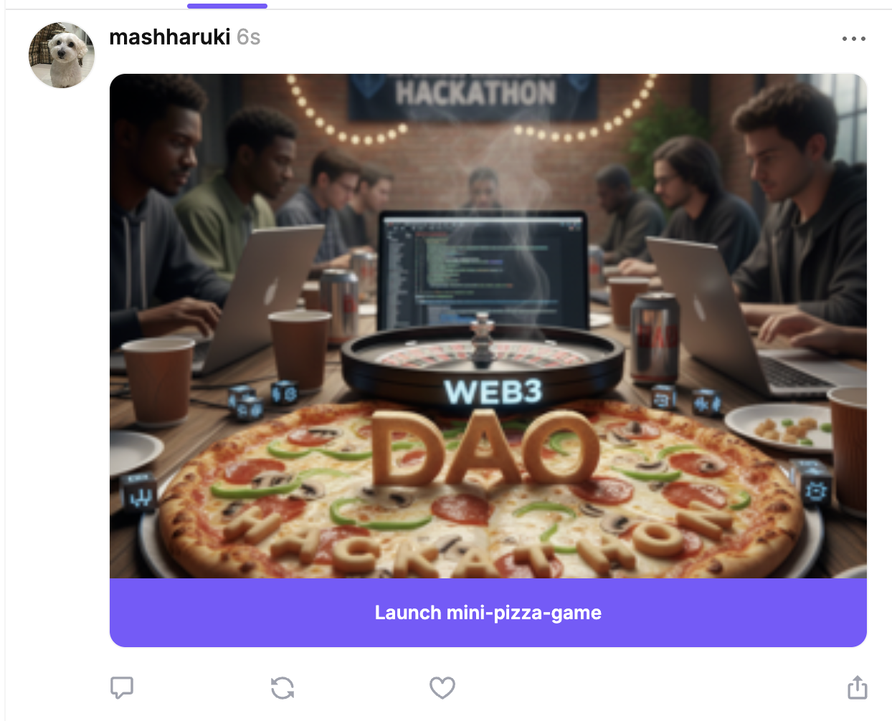
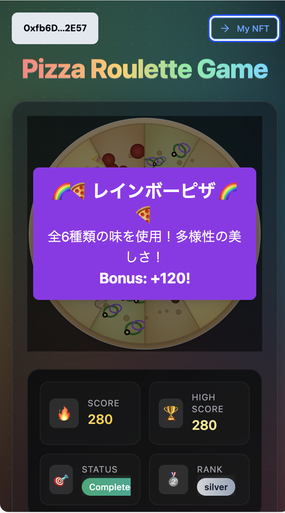
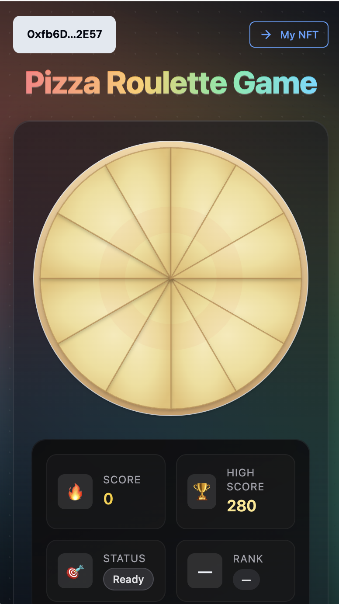
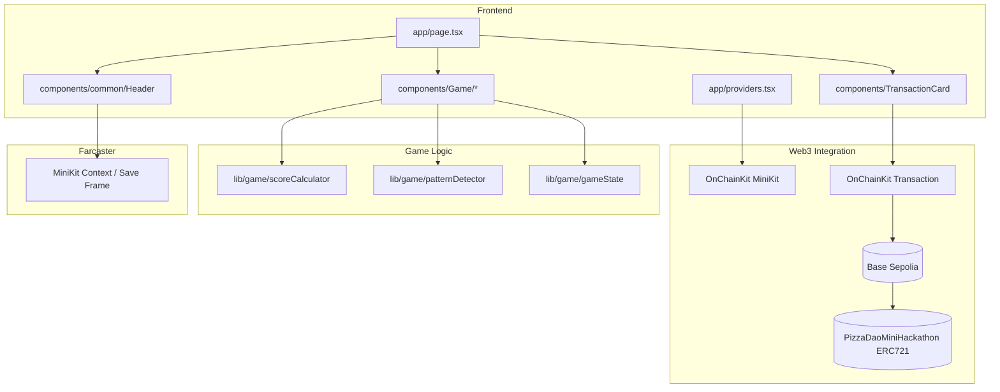

# Pizza Roulette Game (PizzaDAO × Ethreactor Mini Hackathon)

## Event Page

[Luma - PizzaDAO × Ethreactor Mini Hackathon @ ETHTokyo '25](https://luma.com/p6leyvgj?tk=JuHl69)

## Live Demo

- Vercel

  [WebApp URL](https://pizza-dao-mini-hackathon.vercel.app/)

- MiniApp

  [Casted MiniApp](https://farcaster.xyz/mashharuki/0x38f8d234)

  [Registered MiniApp](https://farcaster.xyz/miniapps/__UcwcJwPaVN/mini-pizza-game)

- NFT

  [Rarible Testnet](https://testnet.rarible.com/token/base/0x52D89afa637AEF34A6b680c77B366F3c854485d4:0)

## Demo Video

[Youtube](https://youtu.be/grGPujEIjdw)

## Screenshot







## Overview

Pizza Roulette Game is a single-screen Web3 mini-game that runs as a Farcaster MiniApp.

Players tap a rotating 12-slice pizza board to complete a pizza and, based on their final score, can mint a rank-based NFT on Base Sepolia.

We leverage Coinbase OnChainKit’s MiniKit for the front-end and transaction UX to provide a smooth mobile experience.

- Target chain: Base Sepolia
- NFT contract: See `PIZZA_DAO_MINI_HACKATHON_ADDRESS` in `utils/constants.ts`
- Mint function: `safeMint(address to, string uri)` (ABI in `utils/abis/PizzaDaoMiniHackathon.ts`)

## Key Features

- Wallet connection (OnChainKit / checks connection to Base Sepolia)
- Gameplay (12-slice pizza board, rotation/tap controls, 6 flavors placed randomly)
- Scoring (base points, adjacency bonus, streak bonus, perfect bonus)
- Rank judgment (Diamond / Gold / Silver / Bronze)
- Special pattern detection and effects (e.g., Royal Straight Pizza Flush, Pizza Master)
- NFT minting (after the game, mint with a rank-specific metadata URI)
- Farcaster MiniApp integration (MiniKit context, Save Frame flow)
- Responsive design (mobile-optimized)

## Architecture



### Directory Structure (Excerpt)

```
app/
  ├─ page.tsx            # Main game page
  └─ providers.tsx       # OnChainKit MiniKit Provider
components/
  ├─ Game/               # PizzaBoard, ScoreDisplay, SpecialPatternDisplay, etc.
  ├─ common/             # Header, ErrorDisplay, Button, Icon, etc.
  └─ TransactionCard.tsx # Transaction UI (used when minting)
lib/
  └─ game/               # scoreCalculator, patternDetector, gameState
types/                   # Game-related type definitions
utils/
  ├─ abis/               # Contract ABIs
  └─ constants.ts        # Contract address and special pattern definitions
.kiro/specs/pizza-roulette-game/  # Requirements, design, and task specs
```

## Tech Stack

| Category        | Technology                               | Version/Notes |
|-----------------|-------------------------------------------|---------------|
| Framework       | Next.js                                   | 15.x, App Router |
| Language        | TypeScript                                | strict enabled |
| UI/Styling      | Tailwind CSS                              | integrates with prettier-plugin-tailwindcss |
| State/Query     | React Hooks, @tanstack/react-query        |               |
| Web3            | Coinbase OnChainKit (MiniKit/Tx/Wallet)   | `@coinbase/onchainkit` |
| Web3 Low-level  | wagmi, viem                               | wagmi 2.x / viem 2.x |
| Farcaster       | @farcaster/miniapp-sdk, frame-sdk         | MiniApp integration |
| Chain           | Base Sepolia                              | testnet |
| Data/Cache      | Upstash Redis                             | optional (configure via env) |
| Tooling         | ESLint, Prettier, Tailwind, TypeScript    | |

## Commands

| Task                  | Command         | Description |
|-----------------------|-----------------|-------------|
| Install dependencies  | `pnpm i`        | Initial setup or dependency updates |
| Start dev server      | `pnpm dev`      | Launches http://localhost:3000 |
| Build                 | `pnpm build`    | Production build (includes type checking) |
| Start (production)    | `pnpm start`    | Runs the built output |
| Lint                  | `pnpm lint`     | Static analysis via ESLint |
| Format                | `pnpm format`   | Formatting via Prettier |

## Setup

1) Install dependencies

```
pnpm i
```

2) Prepare environment variables (create `.env.local` using `.env.example` as a reference)

- `NEXT_PUBLIC_ONCHAINKIT_API_KEY`, and other OnChainKit public keys/branding settings
- Configure `NEXT_PUBLIC_URL` (deploy URL) and references like `NEXT_PUBLIC_ICON_URL`
- Optionally set `REDIS_URL` / `REDIS_TOKEN`

3) Start the development server

```
pnpm dev
```

## Development Guide

- See `.kiro/specs/pizza-roulette-game/` for the specs (requirements/design/tasks)
- Web3 integration uses the MiniKitProvider in `app/providers.tsx`; transactions go through `components/TransactionCard.tsx`
- Game logic is consolidated in `lib/game/*` (scoring, pattern detection, state management)
- Contract address/ABI references are in `utils/constants.ts` and `utils/abis/*`

## Notes

- This project targets the Base Sepolia testnet. Do not use with real assets.
- Do not commit `.env.local` (it contains secrets).
- Update contract addresses and metadata URIs according to your deployment status.
